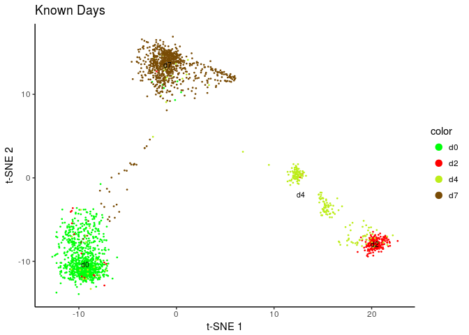
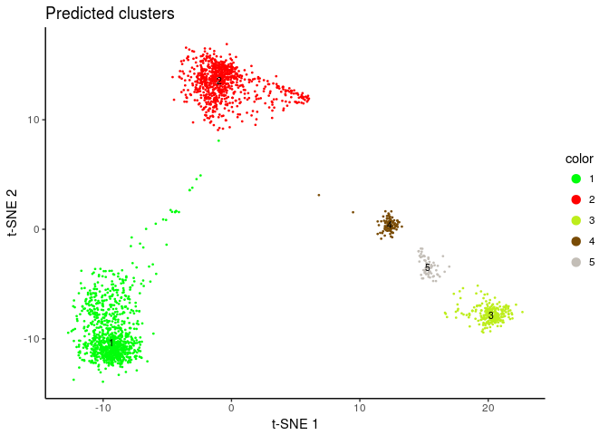

dropClust: Efficient clustering of ultra-large scRNA-seq data
================


###   Refer to the R execution markdown file [here](https://debsin.github.io/dropClust/index.html)

   -   [Prerequisites](#prerequisites)
   -   [dropClust Tutorial](#dropclust-tutorial)
   -   [Filtering and Normalization](#filtering-and-normalization)
   -   [dropClust Sampling and Clustering](#dropclust-sampling-and-clustering)
   -   [DE Gene Analysis](#de-gene-analysis)


Getting Started
===============

### Prerequisites:

1.  Python (&gt;=2.7), R
2.  Python sklearn, igraph packages
3.  R dependencies will be installed automatically when executing the main script.
4.  C++ compiler for Windows users.

#### Executing the script (Linux:Ubuntu):

1.  Download PBMC 68K dataset from: <http://s3-us-west-2.amazonaws.com/10x.files/samples/cell/pbmc68k_rds/pbmc68k_data.rds> and put the pbmc68k\_data.rds file in the "data" directory. The annotation file has already been placed there.

2.  Execute dropClust\_main.R The script returns the predicted cluster IDs, 2D cluster map and a few intermediate results for further downstream analysis.

3.  Obtain the cell-type specific genes and the heatmap by executing the DE\_plot.R script.

#### Executing the script (Windows or other Linux distributions):

Build windows executable/binaries from "louvain/src" files inside the "louvain" directory before executing the main R script.

dropClust Tutorial
------------------

The goal of this tutorial is to guide the users to use dropClust. Most of the specific parameters have been explained so that users can adjust them specific to particular datasets or as per requirement. An analysis has been described in this tuitorial to identify cell type specific genes. The data used in this tutorial has been obtained from <https://www.ncbi.nlm.nih.gov/geo/query/acc.cgi?acc=GSE65525>.

The dataset contains a total of 4 single cell data sets: 1 for mouse embryonic stem (ES) cells (biological replicate day 0 - GSM1599494); 3 samples following LIF withdrawal (days 2 - GSM1599497, 4 - GSM1599498, 7 - GSM1599499); The data folder contains 3 files:

1.  matrix.mtx, a sparse matrix file containg FPKM values with genes in rows and samples in columns.
2.  barcodes.tsv, a single column file where each line represents a sampleID corresponding to the matrix columns.
3.  genes.tsv, a 2 column tab-delimited file where each line contains the (geneID, gene\_symbol) correspnding to the matrix rows.

#### Specify paths

``` r
sourceDir = getwd()
DATA_DIR <- file.path(sourceDir,"data/")        
FIG_DIR <-  paste0(sourceDir,"/plots/")        
REPORT_DIR  <- paste0(sourceDir,"/report/")   
LOUVAIN_DIR <- paste0(sourceDir,"/louvain/")  

dir.create(file.path(FIG_DIR),showWarnings = F)
dir.create(file.path(REPORT_DIR),showWarnings = F)
```

Load relevant libraries & Functions for clustering

``` r
suppressMessages(source("libraries.R") )
suppressMessages(source("tutorial_functions.R"))
```

Load Data and Annotations, Annotations may be omitted if unavailable.

``` r
mouse.data<-read10X(file.path(DATA_DIR,"es_mouse/"))
write.csv(x = mouse.data$gene_symbols, file = "gene_symbols.csv",quote = F,row.names =F)
annotation<- read.table(file.path(DATA_DIR,"annotations.csv"),sep = ',',header = T)
ref_id <- as.factor(annotation$x)
dim(mouse.data$mat)
```

    ## [1]  2717 24175

Filtering and Normalization
---------------------------

Filter poor quality cells. A threshold is provided so that the total UMI count across all genes of the filtered cells is greater than `th`. `th` corresponds to the total count of a cell.

``` r
filtered.data = filter_cells(mouse.data,th = 5000)
```

    ## [1] "470 bad cells present."

``` r
dim(filtered.data$mat)
```

    ## [1]  2247 24175

``` r
anno_labels= ref_id[filtered.data$keep_cells]
no_samples = dim(filtered.data$mat)[1]
```

Filter poor genes. Prior to normalization, the function `normalize_by_umi_2` filters genes which have UMI count greater than `min.count = 2` in atleast `min.cell = 3` cells. The dataset containing filtered cells and filtered genes is then UMI normalized.

``` r
lnorm<-normalize_by_umi_2(filtered.data, min.count=2, min.cell=3)   
```

    ## [1] "Dimensions of filtered Matrix:"
    ## [1] "2247 "  "21897 "

#### Matrix Subsetting

For minimising computation load, one third of the total samples is considered with a maximum of 20000 samples. Select Top Dispersed Genes as denoted by `ngenes_keep`. Write matrix subset to file. The genes are selected based on disperson statsstics.

``` r
set.seed(0)

i=min(20000, round(no_samples/3))
sample_ids = sample(1:no_samples, i)

m_n_ngenes <- matrix.subset(lnorm, sample_ids, ngenes_keep = 1000)
```

    ## [1] "Select variable Genes..."
    ## [1] "Sort Top Genes..."
    ## [1] "Cutoff Genes..."
    ## [1] "Writing Log Normalized whole_matrix, DIM: 2247 1000 ..."
    ## [1] "Writing Log Normalized sub_matrix, DIM: 749 1000 ..."

dropClust Sampling and Clustering
---------------------------------

#### Building neighbourhood graph using LSH.

LSH is performend on on `749` samples. This may take some time. Call python script to perform LSH based seach for nearest neighbours and estimate the neighbourhood graph. The default number of neighbours here is set to 10. The neighbourhood graph is partitioned by executing the louvain module in the shell. The present version of dropClust do not support any adjustment of the partition resolution. However the performance of dropClust does not depend on this as long as the scheme can distinguish the smaller group od population in the graph.

``` r
call_lsh()
```

    ## [1] "Reading sparce matrix..."            
    ## [2] ""                                    
    ## [3] "Converting matrix to dense format..."
    ## [4] "(749, 1000)"                         
    ## [5] "Initialize LSH..."                   
    ## [6] "Fit LSH..."                          
    ## [7] "Convert into adjacency matrix..."    
    ## [8] "Writing graph edgelist..."

``` r
call_louvain()
```

    ## [1] "Assiging Louvain Communities......................"

#### Sub-sampling

Read Louvain clusters for sub-sampling. Specify approximate number of samples to estimate the structure of the data. The samples are expected to sufficiently represent the entire data. The objective is to sample more form the smaller cluster. The `optimized_Pinit()` function uses simulated anneling to fine tune the exponential decay parameter to obtain the specified set of samples. To ensure selection of sufficient representative transcriptomes from small clusters, the exponential decay function used to determine the proportion of transciptomes to be sampled from each clusteris defined in the `sampling()` function. The functions had three floating parameters: `K, pfin and pinit`. The default values are set `K=500 and pfin=0.9` and `pinit` is optimized to restrict the total number of sub-samples to the user defined value.

``` r
opt_pinit = optimized_Pinit(nsamples = 500) 
```

    ## Initializing par with random data inside bounds

``` r
# Sub-sampling using obtained parameter
subsamples_louvain<-sampling(pinit = opt_pinit)
write.csv(x = subsamples_louvain, file = "subsamples_idx",quote = F,row.names =F)
write.csv(x = filtered.data$barcodes[sample_ids[subsamples_louvain]], file = "barcodes_subsamples.csv",quote = F,row.names =F)

# Check the distribution of Sampling across annotated cell types. Skip if annotation is nnabailable.
table(anno_labels[sample_ids[subsamples_louvain]])
```

    ## 
    ##  d0  d2  d4  d7 
    ## 194  59  69 178

The number of samples obtained at this satge `subsamples_louvain = 500` may not be an exact match with the input `nsamples` provided in the optimizer function.

#### Find PC Genes

Find PCA top 200 genes. This may take some time. `top = 200` may be adjusted as found sufficient.

``` r
top_pc_genes<-pc_genes(m_n_ngenes[subsamples_louvain,],top=200) 
```


``` r
write.csv(x = top_pc_genes, file = "pc_gene_ids_sub.csv",quote = F,row.names =F)
```

#### Hierarchical Clustering on subsamples

Adjust Minimum cluster size with argument `mincl` (default = 20)

``` r
ss_sel_genes_mat<-as.matrix(m_n_ngenes[subsamples_louvain,top_pc_genes])
ss_clusters<-ss_clustering(ss_sel_genes_mat, mincl = 20) 
```

    ## [1] "Predicted Clusters: 5"

#### Find K Nearest Neighbours among sub-samples.

The python script calls the LSHforest module to find the approximate K-nearest neighbous of the left put samples. The default value of K here is 5. The neighbours appearing here are among the cells samples previously.

``` r
system("python lsh/proj_neigh.py")
```

#### Un-annotated Cell Assignment

Class Assignment of Un-annotated cells i.e. the remaining cells which were left out due to sampling. For refwrence, clustering performance on the dropClust samples can be checked at this stage. The final clustering performance is guided by clusters at this stage.

``` r
INDEX  = read.csv("neigh.txt",header=F,sep=" ")
dim(INDEX)
```

    ## [1] 2247    5

``` r
clust_col<-cluster_assign(INDEX, ss_clusters)

write.csv(x = clust_col,file ="predicted.csv", quote = F,row.names = F)

sc_metric(clust_col, as.numeric(anno_labels),show_tab = F) # Skip if annotation is unavailable
```

    ##       ARI        RI    Purity 
    ## 0.8572084 0.9366013 0.9327993

### 2D Vizualization:

#### T-sne & Projection of co-ordinates of all samples in 2D

Compute Tsne Projection using PCA top genes on the dropClust samples followed by projecting TSNE co-ordinates on the remaining samples.

<span style="color:red"> **Alert!** The known *reference labels* is for technical demonstration purposes only. The biological significance of the predicted or reference clusters is not known. </span>

``` r
PROJ = compute_2d_embedding(data = as.matrix(m_n_ngenes[subsamples_louvain,top_pc_genes]), ss_clusters, INDEX)

dropClust_df<-as.data.frame(cbind(PROJ, clust_col))
rownames(dropClust_df)<-filtered.data$barcodes
save(dropClust_df,file="demo_proj.Rda")


# 2D Vizualization: Known References to Days.
plot_proj_df<-data.frame("Y1" = PROJ[,1],"Y2" = PROJ[,2],color =as.factor(anno_labels))
#plot_proj_df$color <- factor(plot_proj_df$color)
all_plot(plot_proj_df,"filename","Known Days")
```



``` r
# 2D Vizualization: Predicted Clusters
plot_proj_df_pred<-data.frame(Y1 = PROJ[,1],Y2 = PROJ[,2],color = as.factor(clust_col))
#plot_proj_df_pred$color<-factor(plot_proj_df_pred$color)
all_plot(plot_proj_df_pred,"filename","Predicted clusters")
```



DE Gene Analysis
----------------

Determine cell type specific genes where, the cell type specific genes refer to the genes that is differentially expressed in only one cluster. The user may set the number of cores as available to speedup performance.

``` r
# Load libraries for parallel processing
library(foreach)
library(doParallel)
```

    ## Loading required package: iterators

``` r
#### WARNING!!!! Check number of cores
registerDoParallel(4)
```

#### Sample cells

Sample cells from each cluster for DE analysis. The default is set to 100 cells per cluster.

``` r
# Read predicted cluster IDs
pred_labels = read.csv("predicted.csv", sep="",header = T)
fixed_samples = sample_from_cluster(pred_labels, size = 100)


# Subset whole data with sampled cells for DE analysis
MAT123 = filtered.data$mat[fixed_samples,]
rownames(MAT123)  = filtered.data$barcodes[fixed_samples]
colnames(MAT123)  = filtered.data$gene_symbols

MAT123 = t(MAT123)
# MAT123 = MAT123[match(unique(rownames(MAT123)),rownames(MAT123)),]
dim(MAT123)
```

    ## [1] 24175   464

#### Specify clusters of interest

Specify cluster IDs to inlcude for DE gene analysis, by default all predicted clusters are inlucded in the analysis.

``` r
label = pred_labels$x[fixed_samples]
GRP = c(1:max(pred_labels))
int_cells  = which(label %in% GRP)
ID = label[int_cells]
```

#### Identify DE genes specific to predicted clusters

Set argument `max = 0` for all DE genes, otherwise specify top `max` genes. The criteria to identify a gene which is significantly expressed is determined using two criteria. In this eaxample, The adjusted p\_val (`q_th`) is set to &lt; `0.05` and log2 fold change (`lfc_th`) is set to &lt; `1.5`. Restrict/relax the `DE_genes()` function input parameters to change the total number of cell type specific genes. The function removes potentially poor genes before the DE analysis. By default, the DE analysis is performed on those genes which have UMI count &gt; 4 in atleast `0.5`% of the total number of cells in the input dataset.

``` r
DE_genes_nodes_all  <- DE_genes(raw_data = MAT123[,int_cells] ,labels = ID, max = 0, lfc_th = 1.2, q_th = 0.01, min.count=4, min.cell.per=0.5) 
Mat_ct  = MAT123[DE_genes_nodes_all[["genes"]],int_cells]

## Write significance scores for all DE genes pairs 
filename = file.path(REPORT_DIR,"DE_list.txt")
write_de_pairs(filename,DE_genes_nodes_all[["DE_res"]] )

## Identify DE genes specific to each cluster, if any.
ct_genes.obj = find_ct_genes(ID, DE_genes_nodes_all, Mat_ct)
```

    ## [1] "1_5 5_1 259"
    ## [1] "2_5 5_2 117"
    ## [1] "3_5 5_3 3"
    ## [1] "4_5 5_4 0"
    ## [1] "5_4 4_5 0"

``` r
all_ct_genes = ct_genes.obj$all_ct_genes
ct_genes_list = ct_genes.obj$ct_genes_list
length(all_ct_genes)
```

    ## [1] 379

#### Write cell type specific genes in file.

``` r
filename = file.path(REPORT_DIR, "ct_genes.csv")
write_ct_genes(ct_genes_list, filename)
```

#### Draw heatmap with cell type specific genes.

``` r
heat_in = as.matrix(MAT123[all_ct_genes,int_cells])
ordered_labl = label[int_cells]
filename<-file.path(FIG_DIR,paste0(paste0(GRP,collapse = "_"),"heatmap.pdf"))
# plot_heat_genes(data = heat_in,label = ordered_labl, filename)
```
