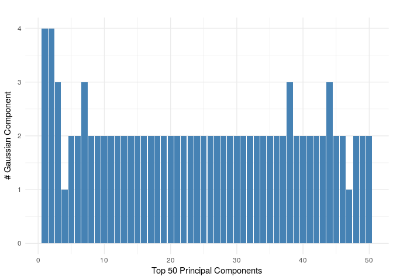
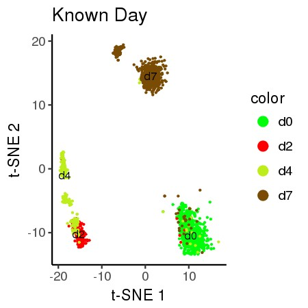
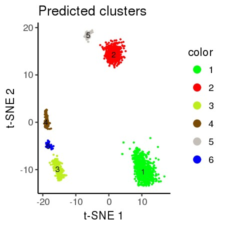

dropClust: Efficient clustering of ultra-large scRNA-seq data
================


###   The 68K PBMC data analysis files are found in the `pbmc_68K_analysis` directory

   -   [Prerequisites](#prerequisites)
   -   [dropClust Tutorial](#dropclust-tutorial)
   -   [Filtering and Normalization](#filtering-and-normalization)
   -   [dropClust Sampling and Clustering](#dropclust-sampling-and-clustering)
   


Getting Started
===============

### Prerequisites:

1.  Python (&gt;=2.7), R
2.  Python `sklearn`, `igraph` packages

#### Linux and Mac Users
The C++ files will be build automatically when executing the main script for the first time.
The `igraph` python package may be installed using the command `pip install --user python-igraph`

#### For Windows users
The C++ Windows binaries are already provided, the user does not need to build them.
The `igraph` python package may be installed by downloading the appropriate pre-compiled binaries found at <https://www.lfd.uci.edu/~gohlke/pythonlibs/#python-igraph> followed by executing the command `python -m pip install desktop/path/igraph.whl`

For all platforms, the R dependencies will be installed automatically when executing the main script for the first time.


dropClust Tutorial
------------------

The goal of this tutorial is to guide the users to use dropClust. Most of the specific parameters have been explained so that users can adjust them specific to particular datasets or as per requirement. An analysis has been described in this tutorial to identify cell type specific genes. 


The demo data used for this tutorial has been obtained from <https://www.ncbi.nlm.nih.gov/geo/query/acc.cgi?acc=GSE65525> and is provided in a compresssed format (`es_mouse.zip`).


The provided data must be decompressed to obtain 3 files inside the `data/es_mouse` folder:

1.  matrix.mtx, a sparse matrix file containg FPKM values with genes in rows and samples in columns.
2.  barcodes.tsv, a single column file where each line represents a sampleID corresponding to the matrix columns.
3.  genes.tsv, a 2 column tab-delimited file where each line contains the (geneID, gene\_symbol) correspnding to the matrix rows.

Below is the corresponding Vigenette of the demo_dropClust_main.R file

#### Specify paths

``` r
sourceDir = getwd() # The directory hosting the current script 
setwd(sourceDir)
DATA_DIR <- file.path(sourceDir,"data/")        
FIG_DIR <-  paste0(sourceDir,"/plots/")        
REPORT_DIR  <- paste0(sourceDir,"/report/")   
LOUVAIN_DIR <- paste0(sourceDir,"/louvain/")  

dir.create(file.path(FIG_DIR),showWarnings = F)
dir.create(file.path(REPORT_DIR),showWarnings = F)
```

Load relevant libraries & functions for clustering

``` r
suppressMessages(source("libraries.R") )
suppressMessages(source("all_functions.R"))
```

Load data and annotations, the annotations may be omitted if unavailable.

``` r
mouse.data<-read10X(file.path(DATA_DIR,"es_mouse/"))
write.csv(x = mouse.data$gene_symbols, file = "gene_symbols.csv",quote = F,row.names =F)
annotation<- read.table(file.path(DATA_DIR,"annotations.csv"),sep = ',',header = T)
ref_id <- as.factor(annotation$x)
dim(mouse.data$mat)
```

    ## [1]  2717 24175

Filtering and Normalization
---------------------------

Filter poor quality cells. A threshold is provided such that the total UMI count across all genes of the filtered cells is greater than `th`. `th` corresponds to the total count of a cell.

``` r
filtered.data = filter_cells(mouse.data,th = 5000)
```

    ## [1] "470 bad cells present."

``` r
dim(filtered.data$mat)
```

    ## [1]  2247 24175

``` r
anno_labels= ref_id[filtered.data$keep_cells]
no_samples = dim(filtered.data$mat)[1]
```

Filter poor genes. Prior to normalization, the function `normalize_by_umi_2` filters genes which have UMI count greater than `min.count = 2` in atleast `min.cell = 3` cells. The dataset containing filtered cells and filtered genes is then UMI normalized.

``` r
lnorm<-normalize_by_umi_2(filtered.data, min.count=2, min.cell=3)   
```

    ## [1] "Dimensions of filtered Matrix:"
    ## [1] "2247 "  "21897 "

#### Matrix Subsetting

For minimising computation load, one third of the total samples is considered with a maximum of 20000 samples. Select Top Dispersed Genes as denoted by `ngenes_keep`. Write matrix subset to file. The genes are selected based on disperson statsstics.

``` r
set.seed(0)

i=min(20000, round(no_samples/3))
sample_ids = sample(1:no_samples, i)

m_n_ngenes <- matrix.subset(lnorm, sample_ids, ngenes_keep = 1000)
```

    ## [1] "Select variable Genes..."
    ## [1] "Sort Top Genes..."
    ## [1] "Cutoff Genes..."
    ## [1] "Writing Log Normalized whole_matrix, DIM: 2247 1000 ..."
    ## [1] "Writing Log Normalized sub_matrix, DIM: 749 1000 ..."

dropClust Sampling and Clustering
---------------------------------

#### Building neighbourhood graph using LSH.

LSH is performend on on `749` samples. This may take some time. Call python script to perform LSH based seach for nearest neighbours and estimate the neighbourhood graph. The default number of neighbours here is set to 10. The neighbourhood graph is partitioned by executing the louvain module in the shell. The present version of dropClust do not support any adjustment of the partition resolution. However the performance of dropClust does not depend on this as long as the scheme can distinguish the smaller group od population in the graph.

``` r
call_lsh()
```

    ## [1] "Reading sparce matrix..."            
    ## [2] ""                                    
    ## [3] "Converting matrix to dense format..."
    ## [4] "(749, 1000)"                         
    ## [5] "Initialize LSH..."                   
    ## [6] "Fit LSH..."                          
    ## [7] "Convert into adjacency matrix..."    
    ## [8] "Writing graph edgelist..."

``` r
call_louvain()
```

    ## [1] "Assiging Louvain Communities......................"

#### Sub-sampling

Read Louvain clusters for sub-sampling. Specify approximate number of samples to estimate the structure of the data. The samples are expected to sufficiently represent the entire data. The objective is to sample more form the smaller cluster. The `optimized_Pinit()` function uses simulated anneling to fine tune the exponential decay parameter to obtain the specified set of samples. To ensure selection of sufficient representative transcriptomes from small clusters, the exponential decay function used to determine the proportion of transciptomes to be sampled from each clusteris defined in the `sampling()` function. The functions had three floating parameters: `K, pfin and pinit`. The default values are set `K=500 and pfin=0.9` and `pinit` may be optimized to restrict the total number of sub-samples to the user defined value.

``` r
opt_pinit = optimized_Pinit(nsamples = 500) 
```

    ## Initializing par with random data inside bounds

``` r
# Sub-sampling using obtained parameter
subsamples_louvain<-sampling(pinit = opt_pinit)
write.csv(x = subsamples_louvain, file = "subsamples_idx",quote = F,row.names =F)
write.csv(x = filtered.data$barcodes[sample_ids[subsamples_louvain]], file = "barcodes_subsamples.csv",quote = F,row.names =F)

# Check the distribution of Sampling across annotated cell types. Skip if annotation is unavailable.
table(anno_labels[sample_ids[subsamples_louvain]])
```

    ## 
    ##  d0  d2  d4  d7 
    ## 194  59  69 178

The number of samples obtained at this satge `subsamples_louvain = 500` may not be an exact match with the input `nsamples` provided in the optimizer function.

#### Find PC Genes

Find PCA top 200 genes. This may take some time. 

``` r
top_pc_genes<-pc_genes(m_n_ngenes[subsamples_louvain,],top=200) 
```



``` r
write.csv(x = top_pc_genes, file = "pc_gene_ids_sub.csv",quote = F,row.names =F)
```

#### Hierarchical Clustering on subsamples

Adjust Minimum cluster size with argument `minClusterSize` (default = 20)
Adjust tree cut with argument level `deepSplit` (default = 3)

``` r
ss_sel_genes_mat<-as.matrix(m_n_ngenes[subsamples_louvain,top_pc_genes])
ss_clusters<-ss_clustering(ss_sel_genes_mat, minClusterSize = 20, deepSplit = 3) 
```

    ## [1] "Predicted Clusters: 5"

#### Find K Nearest Neighbours among sub-samples.

The python script calls the LSHforest module to find the approximate K-nearest neighbous of the left put samples. The default value of K here is 5. The neighbours appearing here are among the cells samples previously.

``` r
system("python lsh/proj_neigh.py")
```

#### Un-annotated Cell Assignment

Class Assignment of Un-annotated cells i.e. the remaining cells which were left out due to sampling. For refwrence, clustering performance on the dropClust samples can be checked at this stage. The final clustering performance is guided by clusters at this stage.

``` r
INDEX  = read.csv("neigh.txt",header=F,sep=" ")
dim(INDEX)
```

    ## [1] 2247    5

``` r
clust_col<-cluster_assign(INDEX, ss_clusters)

write.csv(x = clust_col,file ="predicted.csv", quote = F,row.names = F)

sc_metric(clust_col, as.numeric(anno_labels),show_tab = F) # Skip if annotation is unavailable
```

    ##       ARI        RI    Purity 
    ## 0.8572084 0.9366013 0.9327993

### 2D Vizualization:

#### T-sne & Projection of co-ordinates of all samples in 2D

Compute Tsne Projection using PCA top genes on the dropClust samples followed by projecting TSNE co-ordinates on the remaining samples.

<span style="color:red"> **Alert!** The known *reference labels* is for technical demonstration purposes only. The biological significance of the predicted or reference clusters is not known. </span>

``` r
PROJ = compute_2d_embedding(data = as.matrix(m_n_ngenes[subsamples_louvain,top_pc_genes]), ss_clusters, INDEX)

dropClust_df<-as.data.frame(cbind(PROJ, clust_col))
rownames(dropClust_df)<-filtered.data$barcodes
save(dropClust_df,file="demo_proj.Rda")


# 2D Vizualization: Known References to Days.
plot_proj_df<-data.frame("Y1" = PROJ[,1],"Y2" = PROJ[,2],color =as.factor(anno_labels))
#plot_proj_df$color <- factor(plot_proj_df$color)
all_plot(plot_proj_df,"known.jpg","Known Day")
```



``` r
# 2D Vizualization: Predicted Clusters
plot_proj_df_pred<-data.frame(Y1 = PROJ[,1],Y2 = PROJ[,2],color = as.factor(clust_col))
#plot_proj_df_pred$color<-factor(plot_proj_df_pred$color)
all_plot(plot_proj_df_pred,"pred.jpg","Predicted clusters")
```


