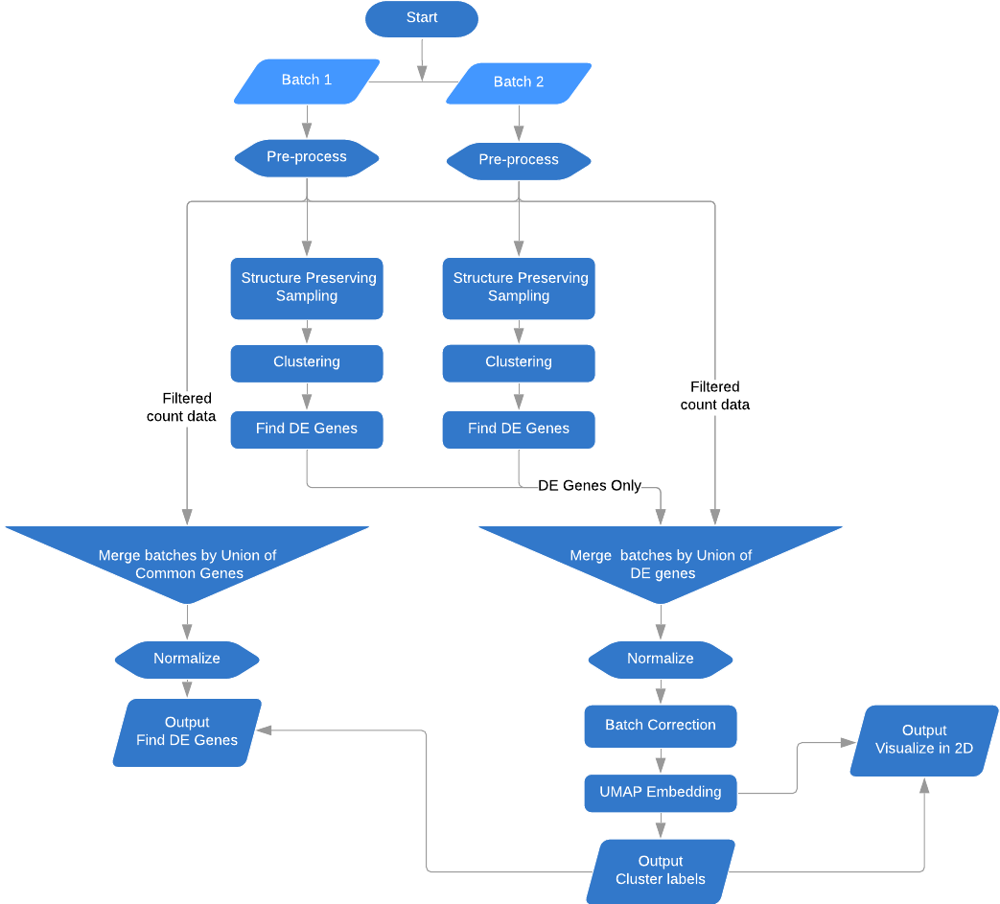
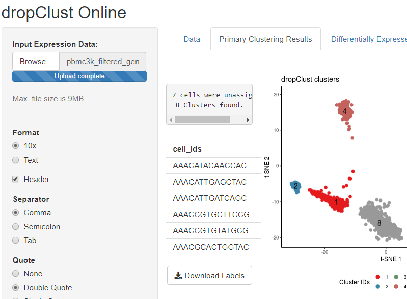

The latest version of dropClust is now available in desktop and online versions.

New Additions
====


Improved Interoperability  |  Integrative Analysis     |     Online web-server     |
:-------------------------:|:-------------------------:|:-------------------------:|
SingleCellExperiment Container          |  |         |


dropClust Online
====

  Visit [https://debsinha.shinyapps.io/dropClust/](https://debsinha.shinyapps.io/dropClust/) for the online version.

   -   [Installation](#desktop-installation)
   -   [Tutorial](#vignette-tutorial)
       -  [Setting-up](#setting-up-directories)
       -  [Loading data](#loading-data)
       -  [Pre-processing](#pre-processing)
       -  [Sampling](#structure-preserving-sampling)
       -  [Clustering](#clustering)
       -  [Visualizing](#visualizing-clusters)
       -  [Differential gene analysis](#find-cluster-specific-differentially-expressed-genes)
       -  [Plot marker genes](#plot-hand-picked-marker-genes)
       -  [Draw heatmap](#draw-heatmap)


Desktop Installation
===============

The developer version of the R package can be installed with the following R commands:

``` r
library(devtools)
install_github("debsin/dropClust", dependencies = T,  ref="devel")
```

Vignette tutorial
------------------
This vignette uses a small data set from the 10X website (3K PBMC dataset [here](http://cf.10xgenomics.com/samples/cell-exp/1.1.0/pbmc3k/pbmc3k_filtered_gene_bc_matrices.tar.gz) ) to demonstrate a standard pipeline. This vignette can be used as a tutorial as well.

Setting up directories
----------------------

``` r

library(dropClust)
set.seed(0)
```

Loading data
------------

dropClust loads UMI count expression data from three input files. The files follow the same structure as the datasets available from the 10X website, i.e.:

-   count matrix file in sparse format
-   transcriptome identifiers as a TSV file and
-   gene identifiers as a TSV file

``` r
# Load Data, path contains decompressed files 
sce <-readfiles(path = "C:/Projects/dropClust/data/pbmc3k/hg19/")
```

Pre-processing
--------------
dropClust performs pre-processing to remove poor quality cells and genes. dropClust is also equipped to mitigate batch-effects that may be present. The user does not need to provide any information regarding the source of the batch for individual transcriptomes. However, the batch-effect removal step is optional.

Cells are filtered based on the total UMI count in a cell specified by parameter `min_count`.  Poor quality genes are removed based on the minimum number of cells `min_count` with expressions above a given threshold `min_count`. 

``` r
# Filter poor quality cells.  A threshold th corresponds to the total count of a cell.
sce<-FilterCells(sce)
sce<-FilterGenes(sce)
```

### Data normalization and removing poor quality genes

Count normalization is then performed with the good quality genes only. Normalized expression values is computed on the raw count data in a SingleCellExperiment object, using the median normalized total count.

```{r}
sce<-CountNormalize(sce)

```
### Selecting highly variable genes 
Further gene selection is carried out by ranking the genes based on its dispersion index. 

```r
# Select Top Dispersed Genes by setting ngenes_keep.
sce<-RankGenes(sce, ngenes_keep = 1000)
```


Structure Preserving Sampling
-----------------------------

Primary clustering is performed in a fast manner to estimate a gross structure of the data. Each of these clusters is then sampled to fine tune the clustering process.

``` r

sce<-Sampling(sce)

```

Gene selection based on PCA
---------------------------
Another gene selection is performed to reduce the number of dimensions. PCA is used to identify genes affecting major components. 

``` r

# Find PCA top 200 genes. This may take some time.
sce<-RankPCAGenes(sce)

```


Clustering
------------------

### Fine tuning the clustering process

By default best-fit, Louvain based clusters are returned. However, the user can tune the parameters to produce the desired number of clusters. The un-sampled transcriptomes are assigned cluster identifiers from among those identifiers produced from fine-tuning clustering. The post-hoc assignment can be controlled by setting the confidence value `conf`. High `conf` values will assign cluster identifiers to only those transcriptomes sharing a majority of common nearest neighbours. 


``` r
# When `method = hclust`
# Adjust Minimum cluster size with argument minClusterSize (default = 20)
# Adjust tree cut with argument level deepSplit (default = 3), higher value produces more clusters.
sce<-Cluster(sce, method = "default", conf = 0.8)
```

Visualizing clusters
--------------------

Compute 2D embeddings for samples followed by post-hoc clustering.

``` r

sce<-PlotEmbedding(sce, embedding = "umap", spread = 10, min_dist = 0.1)

plot_data = data.frame("Y1" = reducedDim(sce,"umap")[,1], Y2 = reducedDim(sce, "umap")[,2], color = sce$ClusterIDs)

ScatterPlot(plot_data,title = "Clusters")


Find cluster specific Differentially Expressed genes
----------------------------------------------------

``` r

DE_genes_all = FindMarkers(sce, selected_clusters=NA, lfc_th = 1, q_th =0.001, nDE=30)

write.csv(DE_genes_all$genes, 
          file = file.path(tempdir(),"ct_genes.csv"),
          quote = FALSE)

```


Plot hand picked marker genes
-----------------------------

``` r

marker_genes = c("S100A8", "GNLY", "PF4")

p<-PlotMarkers(sce, marker_genes)
```


Heat map of top DE genes from each cluster
------------------------------------------

``` r
# Draw heatmap
#############################
p<-PlotHeatmap(sce, DE_res = DE_genes_all$DE_res,nDE = 10)

print(p)
```


Integrative analysis
================

## Loading datasets

Each dataset represents one batch and must be a `SingleCellExperiment`
object. The objects are are merged by passing a list in the next step.

``` r

library(dropClust)
load(url("https://raw.githubusercontent.com/LuyiTian/CellBench_data/master/data/sincell_with_class.RData"))

objects = list()

objects[[1]] = sce_sc_10x_qc

objects[[2]] = sce_sc_CELseq2_qc

objects[[3]] = sce_sc_Dropseq_qc
```

## Merge datasets using dropClust

Datasets can be merged in two ways: using a set of DE genes from each
batch or, using the union of the sets of highly variable genes from each
batch.

    #> 
    #> Procesing Batch 1 ...
    #> 1 bad cells removed.
    #> 257 genes filtered out, 16211 genes remaining.
    #> Sort Top Genes...
    #> Cutoff Genes...
    #> Building graph with 901 nodes...Louvain Partition...Done.
    #> 700 samples extracted.
    #> Find best PCA components...[1]  700 1000
    #> 200 genes selected.
    #> 700 samples and 200 genes used for clustering.
    #> Build Graph with 700 samples...Done.
    #> Louvain Partitioning...Done.
    #> Find nearest neighbours among sub-samples...Done.
    #> Post-hoc Cluster Assignment...Done.
    #> Unassigned Cells 0 
    #> Number of Predicted Clusters: 6 
    #> Computing for DE genes:
    #> Cluster 1 :
    #>  Computing Wilcoxon p values...Done.
    #>  Computing Log fold change values...Done.
    #> Cluster 2 :
    #>  Computing Wilcoxon p values...Done.
    #>  Computing Log fold change values...Done.
    #> Cluster 3 :
    #>  Computing Wilcoxon p values...Done.
    #>  Computing Log fold change values...Done.
    #> Cluster 4 :
    #>  Computing Wilcoxon p values...Done.
    #>  Computing Log fold change values...Done.
    #> Cluster 5 :
    #>  Computing Wilcoxon p values...Done.
    #>  Computing Log fold change values...Done.
    #> Cluster 6 :
    #>  Computing Wilcoxon p values...Done.
    #>  Computing Log fold change values...Done.
    #> 
    #> Procesing Batch 2 ...
    #> 1 bad cells removed.
    #> 11931 genes filtered out, 16273 genes remaining.
    #> Sort Top Genes...
    #> Cutoff Genes...
    #> Find best PCA components...[1]  273 1000
    #> 200 genes selected.
    #> 273 samples and 200 genes used for clustering.
    #> Build Graph with 273 samples...Done.
    #> Louvain Partitioning...Done.
    #> Find nearest neighbours among sub-samples...Done.
    #> Post-hoc Cluster Assignment...Done.
    #> Unassigned Cells 0 
    #> Number of Predicted Clusters: 4 
    #> Computing for DE genes:
    #> Cluster 1 :
    #>  Computing Wilcoxon p values...Done.
    #>  Computing Log fold change values...Done.
    #> Cluster 2 :
    #>  Computing Wilcoxon p values...Done.
    #>  Computing Log fold change values...Done.
    #> Cluster 3 :
    #>  Computing Wilcoxon p values...Done.
    #>  Computing Log fold change values...Done.
    #> Cluster 4 :
    #>  Computing Wilcoxon p values...Done.
    #>  Computing Log fold change values...Done.
    #> 
    #> Procesing Batch 3 ...
    #> 1 bad cells removed.
    #> 958 genes filtered out, 14169 genes remaining.
    #> Sort Top Genes...
    #> Cutoff Genes...
    #> Find best PCA components...[1]  224 1000
    #> 200 genes selected.
    #> 224 samples and 200 genes used for clustering.
    #> Build Graph with 224 samples...Done.
    #> Louvain Partitioning...Done.
    #> Find nearest neighbours among sub-samples...Done.
    #> Post-hoc Cluster Assignment...Done.
    #> Unassigned Cells 0 
    #> Number of Predicted Clusters: 5 
    #> Computing for DE genes:
    #> Cluster 1 :
    #>  Computing Wilcoxon p values...Done.
    #>  Computing Log fold change values...Done.
    #> Cluster 2 :
    #>  Computing Wilcoxon p values...Done.
    #>  Computing Log fold change values...Done.
    #> Cluster 3 :
    #>  Computing Wilcoxon p values...Done.
    #>  Computing Log fold change values...Done.
    #> Cluster 4 :
    #>  Computing Wilcoxon p values...Done.
    #>  Computing Log fold change values...Done.
    #> Cluster 5 :
    #>  Computing Wilcoxon p values...Done.
    #>  Computing Log fold change values...Done.

## Perform correction and dimension reduction

``` r
set.seed(1)
dc.corr <-  Correction(merged_data,  method="default", close_th = 0.1, cells_th = 0.1,
                       components = 10, n_neighbors = 20,  min_dist = 0.5)
#> Batch correcting...
#> from 172 to 97 genes.
#> Embedding with UMAP...Done
```

## Perform Clustering on integrated dimensions

``` r
dc.corr = Cluster(dc.corr,method = "kmeans",centers = 3)
#> Clustering on embedded dimensions...Perfom k-means Clustering...Done.
#> Done.
```

## Visualizing clusters

Compute 2D embeddings for samples followed by post-hoc clustering.

``` r
ScatterPlot(dc.corr, title = "Clusters")
```


\#\# Optional Batch correction Users can use `fastmnn` method for batch
correction. Specific arguments of fastmnn can also be passed through the
`Correction` module.

``` r
merged_data.fastmnn<-Merge(all.objects,use.de.genes = FALSE)
#> 
#> Procesing Batch 1 ...
#> 1 bad cells removed.
#> 257 genes filtered out, 16211 genes remaining.
#> Sort Top Genes...
#> Cutoff Genes...
#> 
#> Procesing Batch 2 ...
#> 1 bad cells removed.
#> 11931 genes filtered out, 16273 genes remaining.
#> Sort Top Genes...
#> Cutoff Genes...
#> 
#> Procesing Batch 3 ...
#> 1 bad cells removed.
#> 958 genes filtered out, 14169 genes remaining.
#> Sort Top Genes...
#> Cutoff Genes...

set.seed(1)
mnn.corr <-  Correction(merged_data.fastmnn,  method="fastmnn", d = 10)

mnn.corr = Cluster(mnn.corr,method = "kmeans",centers = 3)
#> Clustering on embedded dimensions...Perfom k-means Clustering...Done.
#> Done.

ScatterPlot(mnn.corr, title = "Clusters")
```

<!-- -->

## Marker discovery from the merged dataset

``` r
de<-FindMarkers(dc.corr,q_th = 0.001, lfc_th = 1.2,nDE = 10)
#> Computing for DE genes:
#> Cluster 1 :
#>  Computing Wilcoxon p values...Done.
#>  Computing Log fold change values...Done.
#> Cluster 2 :
#>  Computing Wilcoxon p values...Done.
#>  Computing Log fold change values...Done.
#> Cluster 3 :
#>  Computing Wilcoxon p values...Done.
#>  Computing Log fold change values...Done.
de$genes.df
#>       cluster_1         cluster_2         cluster_3        
#>  [1,] "ENSG00000179344" "ENSG00000221923" "ENSG00000122406"
#>  [2,] "ENSG00000121858" "ENSG00000106211" "ENSG00000065978"
#>  [3,] "ENSG00000214548" "ENSG00000100867" "ENSG00000142864"
#>  [4,] "ENSG00000131203" "ENSG00000242265" "ENSG00000253706"
#>  [5,] "ENSG00000151632" "ENSG00000196109" "ENSG00000106153"
#>  [6,] "ENSG00000223865" "ENSG00000129991" "ENSG00000258484"
#>  [7,] "ENSG00000198502" "ENSG00000105568" "ENSG00000162433"
#>  [8,] "ENSG00000100234" "ENSG00000178150" "ENSG00000132432"
#>  [9,] "ENSG00000154277" "ENSG00000130724" "ENSG00000167641"
#> [10,] "ENSG00000134339" "ENSG00000170906" "ENSG00000256670"
```
